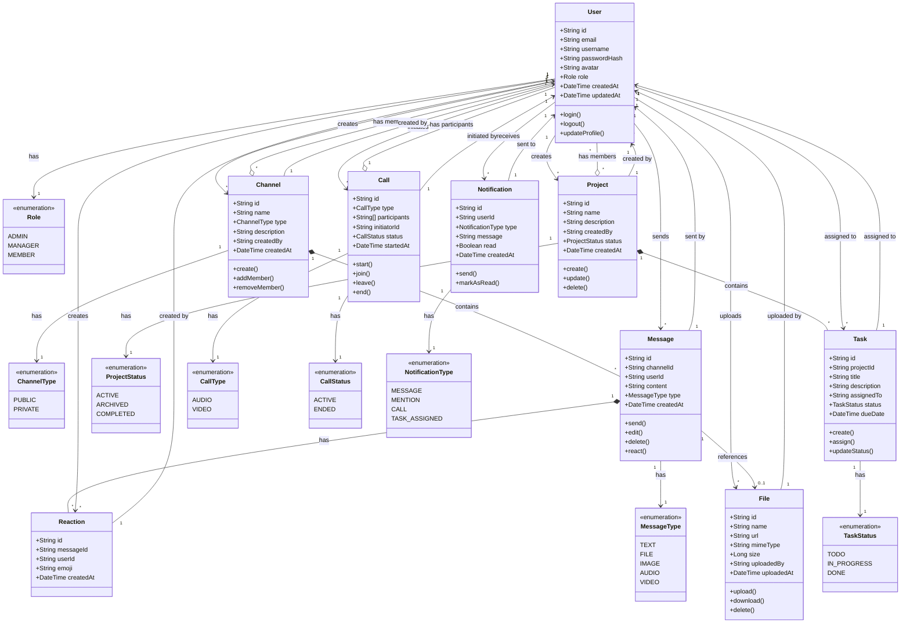

# InfinityTalk - Class Diagram

```mermaid
classDiagram
    class User {
        +String id
        +String email
        +String username
        +String passwordHash
        +String avatar
        +Role role
        +DateTime createdAt
        +DateTime updatedAt
        +login()
        +logout()
        +updateProfile()
    }
    
    class Role {
        <<enumeration>>
        ADMIN
        MANAGER
        MEMBER
    }
    
    class Channel {
        +String id
        +String name
        +ChannelType type
        +String description
        +String createdBy
        +DateTime createdAt
        +create()
        +addMember()
        +removeMember()
    }
    
    class ChannelType {
        <<enumeration>>
        PUBLIC
        PRIVATE
    }
    
    class Message {
        +String id
        +String channelId
        +String userId
        +String content
        +MessageType type
        +DateTime createdAt
        +send()
        +edit()
        +delete()
        +react()
    }
    
    class MessageType {
        <<enumeration>>
        TEXT
        FILE
        IMAGE
        AUDIO
        VIDEO
    }
    
    class Reaction {
        +String id
        +String messageId
        +String userId
        +String emoji
        +DateTime createdAt
    }
    
    class File {
        +String id
        +String name
        +String url
        +String mimeType
        +Long size
        +String uploadedBy
        +DateTime uploadedAt
        +upload()
        +download()
        +delete()
    }
    
    class Project {
        +String id
        +String name
        +String description
        +String createdBy
        +ProjectStatus status
        +DateTime createdAt
        +create()
        +update()
        +delete()
    }
    
    class ProjectStatus {
        <<enumeration>>
        ACTIVE
        ARCHIVED
        COMPLETED
    }
    
    class Task {
        +String id
        +String projectId
        +String title
        +String description
        +String assignedTo
        +TaskStatus status
        +DateTime dueDate
        +create()
        +assign()
        +updateStatus()
    }
    
    class TaskStatus {
        <<enumeration>>
        TODO
        IN_PROGRESS
        DONE
    }
    
    class Call {
        +String id
        +CallType type
        +String[] participants
        +String initiatorId
        +CallStatus status
        +DateTime startedAt
        +start()
        +join()
        +leave()
        +end()
    }
    
    class CallType {
        <<enumeration>>
        AUDIO
        VIDEO
    }
    
    class CallStatus {
        <<enumeration>>
        ACTIVE
        ENDED
    }
    
    class Notification {
        +String id
        +String userId
        +NotificationType type
        +String message
        +Boolean read
        +DateTime createdAt
        +send()
        +markAsRead()
    }
    
    class NotificationType {
        <<enumeration>>
        MESSAGE
        MENTION
        CALL
        TASK_ASSIGNED
    }
    
    %% ============================================
    %% COMPOSITION RELATIONS (Strong - Child cannot exist without parent)
    %% ============================================
    Channel "1" *-- "*" Message : contains
    Message "1" *-- "*" Reaction : has
    Project "1" *-- "*" Task : contains
    
    %% ============================================
    %% AGGREGATION RELATIONS (Weak - Child can exist independently)
    %% ============================================
    Channel "*" o-- "*" User : has members
    Project "*" o-- "*" User : has members
    Call "1" o-- "*" User : has participants
    
    %% ============================================
    %% ASSOCIATION RELATIONS (Simple relationships)
    %% ============================================
    
    %% User Associations
    User "1" --> "1" Role : has
    User "1" --> "*" Message : sends
    User "1" --> "*" Channel : creates
    User "1" --> "*" Project : creates
    User "1" --> "*" Task : assigned to
    User "1" --> "*" File : uploads
    User "1" --> "*" Call : initiates
    User "1" --> "*" Notification : receives
    User "1" --> "*" Reaction : creates
    
    %% Channel Associations
    Channel "1" --> "1" ChannelType : has
    Channel "1" --> "1" User : created by
    
    %% Message Associations
    Message "1" --> "1" MessageType : has
    Message "1" --> "1" User : sent by
    Message "1" --> "0..1" File : references
    
    %% Reaction Associations
    Reaction "1" --> "1" User : created by
    
    %% File Associations
    File "1" --> "1" User : uploaded by
    
    %% Project Associations
    Project "1" --> "1" ProjectStatus : has
    Project "1" --> "1" User : created by
    
    %% Task Associations
    Task "1" --> "1" TaskStatus : has
    Task "1" --> "1" User : assigned to
    
    %% Call Associations
    Call "1" --> "1" CallType : has
    Call "1" --> "1" CallStatus : has
    Call "1" --> "1" User : initiated by
    
    %% Notification Associations
    Notification "1" --> "1" NotificationType : has
    Notification "1" --> "1" User : sent to
```
