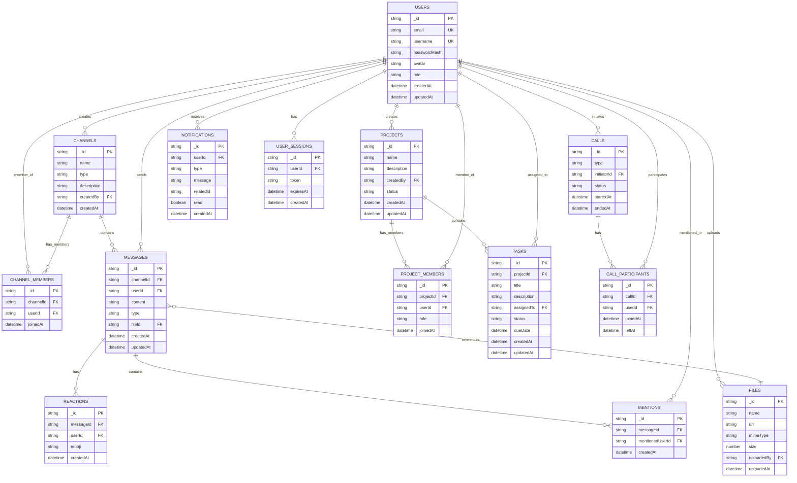

# InfinityTalk - Entity Relationship Diagram (ERD)

## Collections Description

### USERS
- Stores user accounts and authentication data
- Role: ADMIN, MANAGER, MEMBER

### CHANNELS
- Communication channels (public/private)
- Type: PUBLIC, PRIVATE

### CHANNEL_MEMBERS
- Many-to-many relationship between users and channels

### MESSAGES
- Chat messages in channels
- Type: TEXT, FILE, IMAGE, AUDIO, VIDEO

### REACTIONS
- Emoji reactions on messages

### MENTIONS
- User mentions (@username) in messages

### FILES
- Uploaded files and documents

### PROJECTS
- Project management entities
- Status: ACTIVE, ARCHIVED, COMPLETED

### PROJECT_MEMBERS
- Many-to-many relationship between users and projects

### TASKS
- Tasks within projects
- Status: TODO, IN_PROGRESS, DONE

### CALLS
- Audio/video call sessions
- Type: AUDIO, VIDEO
- Status: ACTIVE, ENDED

### CALL_PARTICIPANTS
- Participants in calls

### NOTIFICATIONS
- User notifications
- Type: MESSAGE, MENTION, CALL, TASK_ASSIGNED

### USER_SESSIONS
- JWT tokens and session management
